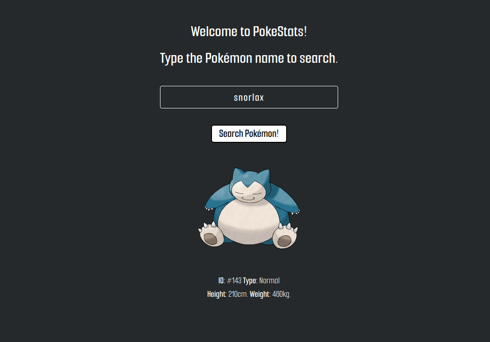

# PokéStats
   

In PokéStats, you can search for any Pokémon and we return the ID, Type, Height and Weight of the given Pokémon.
> Use <a href="https://pokeapi.co/"> PokéAPI v2. </a>

  
🚀 To run, you need to:
```
  > Clone this repository
  
  > yarn install
  
  > yarn start
```
> ❓ To install yarn, run this on terminal: ```npm install --global yarn```

## Screenshot

